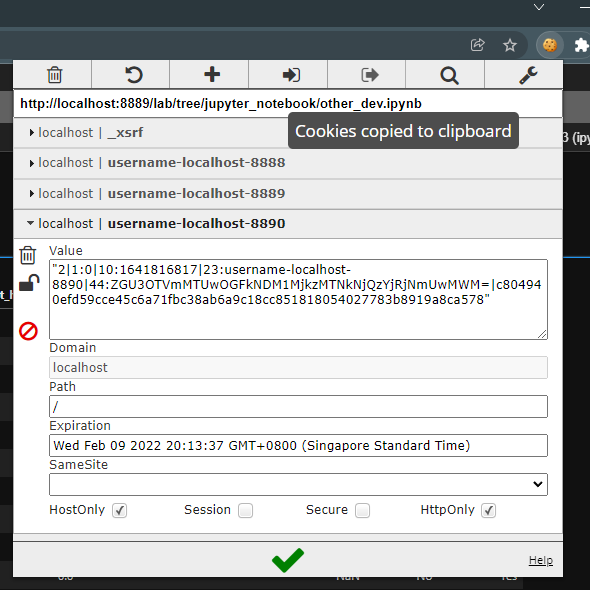

# Scrape madeinchina.com

Python script for scrape sales name and contact numbers using company url as the input. To see the contact number appear on the front-end, a user at least logged in to madeinchina.com.  

In this project, instead of do automation login, I prefer to just do [copy and paste](#copy-and-paste-cookies) the cookies using chrome extension named [EditThisCookies](https://chrome.google.com/webstore/detail/editthiscookie/fngmhnnpilhplaeedifhccceomclgfbg).

I also use asynchronous programming for render and scrape multiple urls. The reason is, it will save more time for scraping the bigger size of data.  

Last but not least, I also write a script for converting the output data to csv file using `pandas` library and `to_csv()` method.

___  
## Copy and Paste Cookies

